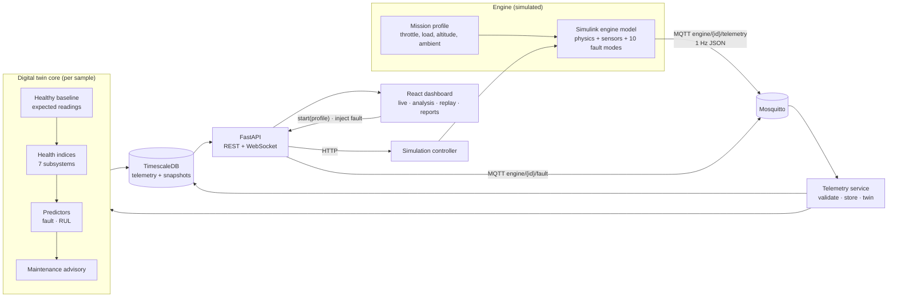
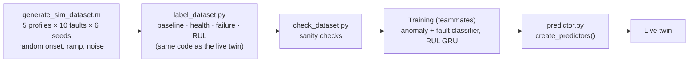

# Digital Twin Architecture

Architecture of the aero-piston engine digital twin for MALE UAVs (SIH 2026). This document maps the system to the problem statement's required capabilities (sections A–F), describes each layer and its interfaces, and lists the known limitations of the prototype.

Related documents:
- [`PROBLEM_STATEMENT.md`](PROBLEM_STATEMENT.md): the SIH problem statement this answers.
- [`telemetry-schema.md`](telemetry-schema.md): telemetry fields and fault catalogue.
- [`DEPLOYMENT_ROADMAP.md`](DEPLOYMENT_ROADMAP.md): path from this prototype to test rigs, the GCS and fleets.
- [`../ANOMALY_MODEL_GUIDE.md`](../ANOMALY_MODEL_GUIDE.md) and [`../RUL_MODEL_GUIDE.md`](../RUL_MODEL_GUIDE.md): ML training.

---

## 1. Overview

The **physical engine** is represented by a Simulink model. Everything downstream of MQTT is engine-agnostic: replacing the simulator with a real engine's data acquisition (CAN → MQTT gateway, see the roadmap) needs no change to the twin, database, API or dashboard.

---

## 2. Coverage of the problem statement

| PS section | Requirement | Where it lives |
|---|---|---|
| **A. Core framework** | Virtual engine synchronised with live data | Healthy baseline (`backend/twin/baseline.py`) predicts what a healthy engine should read *now*, in the current flight conditions; every sample is compared with it |
| | Modular, scalable architecture | Independent services (simulator, broker, telemetry service, API, UI) connected by MQTT/HTTP; `engine_id` in every topic and table |
| | Real-time ingestion | MQTT 1 Hz → validated (`TelemetryCreate`) → TimescaleDB hypertable |
| **B. Health monitoring** | RPM, CHT, EGT, oil P/T, fuel flow, vibration, battery/alternator, injection timing | All 12 signals published and stored; 7 subsystem health indices (`backend/twin/service.py`) |
| **C. Fault detection** | Misfire, injector, cooling, lubrication, sensor drift, combustion instability, overheating, vibration | 9 simulated fault modes (+ fuel starvation), each growing gradually; detected by the fault predictor before failure |
| **D. AI/ML layer** | Anomaly detection, RUL, trend analysis, maintenance recommendations | `backend/twin/predictor.py`: trained XGBoost fault classifier and GRU RUL model (rule-based stand-ins as fallback), `backend/twin/advisory.py` |
| **E. Simulation & replay** | Replay of historical missions | Every run is its own mission; `GET /missions/{id}/replay` + replay UI |
| | High altitude, endurance, hot weather, rapid throttle | `simulation/mission_profile.m`, selectable from the dashboard |
| **F. Dashboard** | Real-time health, fault alerts, efficiency trends, maintenance advisory, mission-wise reports | React dashboard: live HUD, advisory panel, efficiency index, analysis page, downloadable mission report |

---

## 3. Layers

### 3.1 Engine model (Simulink)

`simulation/AeroPistonEngineSimulator.slx`, with parameters in `simulation/engine_params.m`:

- **Engine core:** 1-cylinder 4-stroke ~100 cc. Torque ∝ throttle × ISA air-density ratio; rotational dynamics with friction and load.
- **Subsystems:** fuel, thermal (CHT and EGT heat balance), lubrication (oil temperature and pressure), vibration, electrical (28 V bus, alternator, battery), ECU injection (timing map and pulse width).
- **Sensors:** every published signal passes lag → drift → noise → sampling → range limits.
- **Faults:** 10 `Fault_ID`s select rows of fault × severity lookup tables. Severity ramps 0 → 1 from onset, so faults develop gradually, as real degradation does. Each fault maps to a PS fault category (`docs/telemetry-schema.md`).
- **Inputs (mission profile):** throttle, engine load, altitude, ambient temperature. Five profiles: cruise, high altitude, hot weather, endurance, rapid throttle.

The live publisher (`simulation/simulink_mqtt_stream.m`) steps the model and publishes 1 Hz JSON over MQTT. The simulation controller (`simulation/simulation_controller.py`) starts and stops it with the chosen profile; the stream script also subscribes to the fault topic itself (through `simulation/MqttLite.m`, a small MQTT client written in plain MATLAB).

### 3.2 Ingestion

- **Validation:** MQTT topic `engine/{engine_id}/telemetry`. Payloads are validated by `TelemetryCreate` (unknown fields rejected, timestamps timezone-aware).
- **Storage:** valid samples go to the `telemetry` hypertable (TimescaleDB). Duplicates are ignored; gaps and out-of-order samples are recorded as ingestion events.

### 3.3 Digital twin core (per sample)

Run by the telemetry service for every stored sample (`DigitalTwinService.process`):

1. **Healthy baseline:** a ridge regression on physics-based features (ISA density ratio, lagged power and load for thermal inertia) predicts the healthy RPM, EGT, CHT, oil pressure and temperature, bus voltage and alternator current for the current flight conditions. Fitted on healthy simulator flights across all profiles; held-out RMSE ≈ 9 RPM, 0.8 °C CHT.
2. **Health indices:** 7 subsystem scores (thermal, combustion, lubrication, mechanical, electrical, injection, sensor), from residuals against the baseline, signal roughness, vibration RMS and an ECU fuel-consistency check. Limits shift with the baseline, so a healthy engine scores ~97 in every profile.
3. **Failure definition** (`backend/twin/failure.py`): failure = the weakest engine subsystem, averaged over 90 s, stays below 30. A failing sensor never counts as engine failure. The same definition labels the ML dataset and drives the live countdown.
4. **Predictors** (`backend/twin/predictor.py`): a fault model (anomaly score, fault ID, confidence, top signals) and a RUL model (seconds to failure, with a confidence band). The trained models run today (XGBoost classifier, GRU RUL model via ONNX); the rule-based stand-ins implement the same interface and take over if a model can't load.
5. **Operating state:** NOMINAL / WARNING / DEGRADED / CRITICAL, from health and predictions.
6. **Maintenance advisory** (`backend/twin/advisory.py` + `advisory_rules.json`): urgency level (MONITOR → CRITICAL) from the time to failure, actions per fault (in flight, and after landing), the evidence behind it, and persistence so it doesn't flicker.

Everything is stored in one **health snapshot** per sample. The API and WebSocket only read snapshots, so a prediction is computed once and served to any number of viewers.

### 3.4 API

FastAPI (`backend/api`), REST under `/api` plus a WebSocket:

| Endpoint | Purpose |
|---|---|
| `GET /dashboard/{engine}` | Everything the live view needs |
| `GET /engines/{id}/health`, `/health/history`, `/alerts` | Twin state, history, alerts |
| `POST /engines/{id}/simulation/start?profile=…` / `stop` | Start a mission with a profile |
| `POST /engines/{id}/fault?fault_id=N` | Inject a fault (demo) |
| `GET /missions`, `/missions/{id}/telemetry`, `/replay`, `/report`, `/baseline` | Mission history, replay, health report, expected healthy readings |
| `WS /ws/engines/{id}?mission_id=…` | Live telemetry, health, prediction, advisory every 2 s |

### 3.5 Dashboard

React + Vite (`frontend/`):

- **Live view:** engine signals with an RPM gauge; flight conditions; overall and subsystem health; fault, anomaly score, time to failure and the signals behind the call; efficiency index; maintenance advisory panel; mission profile selector; fault injection.
- **Analysis view:** per-mission charts (thermal, performance, lubrication, efficiency, electrical, injection), health trends, anomaly and RUL charts, mission replay, and the mission health report (downloadable as Markdown).

---

## 4. ML pipeline

Labels are generated by the same health and failure code the live twin runs, so the models learn exactly what the dashboard means by "failure". The trained models replace the rule-based stand-ins through one function (`create_predictors()`); nothing else changes.

---

## 5. Scalability and modularity

- **Multiple engines:** every topic, table row and API route carries `engine_id`. The telemetry service subscribes to `engine/+/telemetry`.
- **Missions:** each run is a separate mission (`mission_<UTC date>_<time>_<profile>`), the unit of replay and reporting.
- **Compute:** the twin's per-sample work is O(window) on the latest 300–1200 samples of one mission. Predictions are stored once and read many times.
- **Storage:** TimescaleDB hypertable for telemetry. Retention and continuous aggregates can be added for fleet-scale history.
- **Replaceable parts:** the data source (simulator ↔ CAN gateway), the predictors (stand-ins ↔ trained models) and the advisory rules (JSON) can each change without touching the others.

---

## 6. Known limitations of the prototype

| Limitation | Effect | Mitigation |
|---|---|---|
| Simulated engine only | Accuracy is measured on simulated flights | Calibrate the baseline and models on engine-test-rig data (roadmap phase 2) |
| Compressed time scale | Faults develop over 1–15 minutes instead of hours | Time constants are parameters; RUL is in "simulator seconds" |
| Fuel map vs torque | ~2.5× realistic fuel per kWh | Efficiency shown as an index relative to a healthy engine, not as absolute BSFC |
| CHT scale runs low | CHT ~80 °C at cruise, colder at altitude | Consistent across the dataset; recalibrate with real data |
| Autoencoder anomaly detector not yet usable | Anomaly score comes from the classifier's P(healthy) | v2 retraining package in `anomaly-model-new/v2/` |
| Security | MQTT accepts anonymous clients; no API authentication | TLS, client certificates and authentication (roadmap phase 3) |
| One simulation controller | One live mission at a time | Fleet simulation would run multiple publishers |
